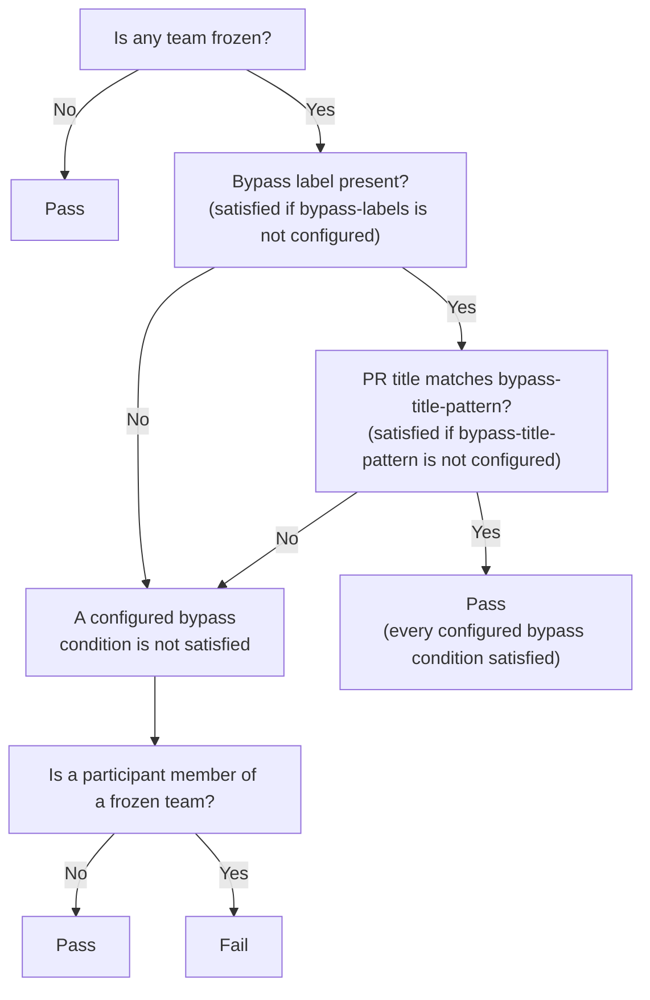

# Team Freeze Guard

`team-freeze-guard` enforces per-team code freezes on GitHub pull requests.

When a pull request author or commit committer belongs to a configured frozen GitHub team, the pull request must satisfy every configured bypass mechanism: it must carry at least one of the configured bypass labels (when `bypass-labels` is set), and its title must match the configured `bypass-title-pattern` (when set). Otherwise, the action fails with `Your team is frozen`, and a required GitHub ruleset check prevents the pull request from being merged.

The action uses [DataDog/dd-octo-sts-action](https://github.com/DataDog/dd-octo-sts-action) internally to obtain a short-lived GitHub token with organization membership permissions. It does not require a personal access token or a GitHub App private key in the consuming repository. This GitHub Action does not contain any other mechanism for obtaining this membership permission, which means it is meant to work only on DataDog's org repositories.

## How it works

For every relevant pull request event, the action evaluates this rule:



A participant is:

- The pull request author.
- The GitHub-linked committer of the pull request's current head commit.

Only the current head commit is checked, not the pull request's full commit history, and commit *authorship* is not checked, only the committer — see [`docs/limitations.md`](docs/limitations.md) for the tradeoffs this implies.


## Workflow configuration

The workflow uses `pull_request_target` rather than `pull_request` because it needs a trusted OIDC identity and correct permissions even for pull requests from forks, which `pull_request` cannot provide. Do not change the trigger to `pull_request`.

Create `.github/workflows/team-freeze-guard.yml`:

```yaml
name: Team freeze guard

on:
  pull_request_target:
    types:
      - opened
      - reopened
      - synchronize
      - labeled
      - unlabeled
      - ready_for_review
      - edited

permissions:
  id-token: write
  contents: read

jobs:
  team-freeze-guard:
    name: Team freeze guard
    runs-on: ubuntu-latest

    steps:
      - uses: DataDog/team-freeze-guard@<full-commit-sha>
        with: 
          bypass-labels: |
            ci-remediation
          frozen-teams: |
            @DataDog/apm-sdk
            @DataDog/profiling
```

Pin `team-freeze-guard` to a full commit SHA, and track new releases explicitly (for example with Dependabot's `github-actions` ecosystem) rather than floating a tag or branch, so upgrades are a reviewed, deliberate change.

Team names must be GitHub team slugs, not display names. For example, configure `@DataDog/apm-sdk`, not `@DataDog/APM SDK` or `apm-sdk`.

`frozen-teams` is a newline-delimited list, one `@org/team-slug` per line, as shown above. Blank lines are ignored. Every team must belong to the same GitHub organization as the repository; a team from another organization is rejected as a configuration error, since the Octo STS token is scoped to a single organization.

`bypass-labels` is also a newline-delimited list, one label name per line. A pull request needs only one of the configured labels to satisfy this mechanism; matching is case-sensitive, so a configured label must match the pull request's label exactly.

`bypass-title-pattern` is a single regular expression (JavaScript `RegExp` syntax), tested against the pull request's title with `.test()`. Leave it empty (the default) to disable this mechanism.

When both `bypass-labels` and `bypass-title-pattern` are configured, both must be satisfied to bypass the check: a bypass label alone, or a matching title alone, is not enough. Each mechanism that is left unconfigured (empty) is treated as satisfied and does not block the bypass.

When `bypass-title-pattern` is configured, include `edited` in the workflow's `types`, as shown above, so that editing the pull request title re-triggers evaluation.

Do not add a checkout step. The action reads the pull request and the trusted configuration through the `with` blocks; it must never execute code from the pull request branch.

An empty `frozen-teams` values means that no check is performed (no code freeze):

```yml
        with: 
          bypass-labels: |
            ci-remediation
          frozen-teams:
```

### Configuration fields

| Field | Required | Default | Description |
| --- | --- | --- | --- |
| `bypass-labels` | No | None (disabled) | Newline-delimited list of labels; any one present satisfies this bypass mechanism when a participant belongs to a frozen team. Empty disables it. Matching is case-sensitive. |
| `bypass-title-pattern` | No | None (disabled) | Regular expression the pull request title must match to satisfy this bypass mechanism. Empty disables it. When combined with `bypass-labels`, both configured mechanisms must be satisfied. |
| `frozen-teams` | Yes | None | Newline-delimited list of frozen GitHub team slugs. An empty list disables all freezes. |
| `frozen-message` | No | `Your team is frozen` | Message used as the check failure reason and summary heading when a frozen team participates. |


### Required workflow permissions

| Permission | Reason |
| --- | --- |
| `id-token: write` | Allows `dd-octo-sts-action` to exchange the workflow's OIDC identity for a short-lived GitHub App token. |
| `contents: read` | Allows the default `GITHUB_TOKEN` to read repository and commit data needed to resolve the head commit's committer. |

An action cannot grant these permissions to itself; they must be declared by the calling workflow.

Keep `team-freeze-guard` alone in its job. `id-token: write` applies to every step in the job, so unrelated third-party actions should not share the same job.

The organization scope, Octo STS policy name, and Octo STS pool are intentionally controlled by the action rather than exposed as repository inputs.

## Enforcing the result with a ruleset

Running the action is not sufficient by itself. Configure a GitHub repository or organization ruleset that requires the following status check on the target branch:

```text
Team freeze guard
```

Recommended rollout:

1. Add the repository configuration and workflow.
2. Run the check on representative pull requests.
3. Add the required status check to a ruleset in **Evaluate** mode.
4. Confirm that the ruleset reports the expected violations.
5. Change the ruleset to **Active**.
6. Configure the ruleset so that administrators do not silently bypass it, except for explicitly approved incident procedures.

Keep the job name stable. Changing it changes the status-check name and can leave the ruleset waiting for a check that is no longer produced.

## Expected behavior

| Situation | Result |
| --- | --- |
| No frozen teams are configured | Pass |
| No participant belongs to a frozen team | Pass |
| A participant belongs to a frozen team and no configured bypass mechanism is satisfied | Fail |
| A participant belongs to a frozen team and every configured bypass mechanism is satisfied | Pass |
| A participant belongs to a frozen team, both `bypass-labels` and `bypass-title-pattern` are configured, and only one of them is satisfied | Fail |
| The last remaining bypass label is removed while a participant belongs to a frozen team | Re-evaluate and fail |
| A new commit introduces a frozen participant | Re-evaluate and require the configured bypass mechanisms |
| The configuration is missing or malformed | Fail |
| A configured frozen team is unknown or inaccessible | Fail |
| GitHub or Octo STS cannot be queried reliably (rate limiting, pagination, or unexpected responses) | Fail |

Example failure summary:

```text
Your team is frozen.

- @octocat belongs to frozen team @DataDog/apm-sdk.

- Bypass label: not satisfied — add one of these labels to the pull request: `ci-remediation`.
```

Each configured bypass mechanism gets its own line, reporting whether it is satisfied and, if not, what is required to satisfy it — for example, with both mechanisms configured and only the title pattern satisfied:

```text
Your team is frozen.

- @octocat belongs to frozen team @DataDog/apm-sdk.

- Bypass label: not satisfied — add one of these labels to the pull request: `ci-remediation`.
- Bypass title pattern: satisfied.
```

## Protecting the policy files

Protect this path with `CODEOWNERS` and required review from the CI-owning team:

```text
/.github/workflows/team-freeze-guard.yml
```

Otherwise, someone able to merge changes to this file could weaken or remove the enforcement policy.

See [`docs/limitations.md`](docs/limitations.md) for known operational limitations, including reconciliation after configuration or team-membership changes, label authorization, and merge queue support.
